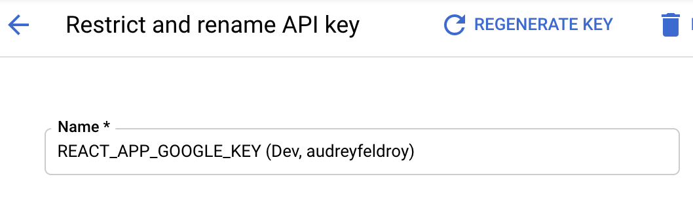
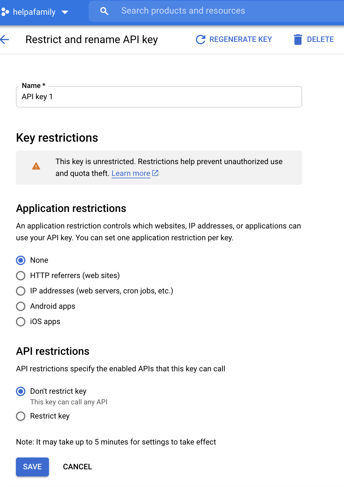
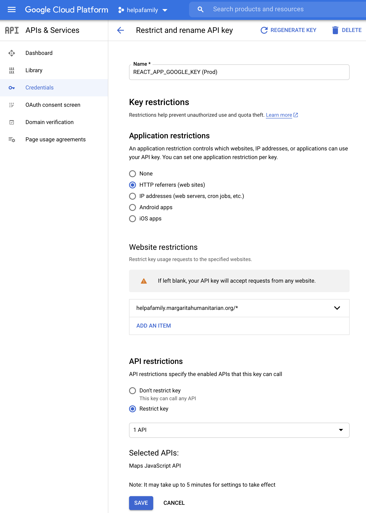

# Environment Variables

We use environment variables to store secrets such as API keys.

## How This Project Sets Per-Environment Variables

To set environment variables in each environment:

- Dev: Copy _.env.example_ to _.env_ then replace any sample values with real ones as per below
- Prod: Set the Preview and Production values in [Vercel > Settings > Environment Variables](https://vercel.com/margaritahumanitarian/helpafamily/settings/environment-variables)

## Google Maps API Key

`NEXT_PUBLIC_GMAPS_JS_API_KEY `

API key for the Maps JavaScript API.

### Getting a Key

Instructions for getting this key: [Maps JavaScript API: Using API Keys > Creating API Keys](https://developers.google.com/maps/documentation/javascript/get-api-key#creating-api-keys)

In the Google console, name it something like ** NEXT_PUBLIC_GMAPS_JS_API_KEY (Dev, audreyfeldroy)** or ** NEXT_PUBLIC_GMAPS_JS_API_KEY (Prod)**:

That will help you identify which key is for which environment.

### Key Restrictions

If you're just using this key for local development, it's okay to leave _Key restrictions_ as None like this:

For the Vercel preview key, the *Website restrictions* setting will be something like:

A production key should have these restrictions:

## Setting Your Key for Local Development

When you run `yarn dev`, if your Google Maps JS API Key isn't set yet you'll get an error in the browser JS console like:

> js?v=3.exp&libraries=geometry,drawing,places&key=undefined:100 Google Maps JavaScript API error: InvalidKeyMapError
> https://developers.google.com/maps/documentation/javascript/error-messages#invalid-key-map-error

To fix that:

1. Set this in `.env`, replacing it with your actual key:

NEXT_PUBLIC_GMAPS_JS_API_KEY = "<your Google Maps JavaScript API Key here>"

2. ???
